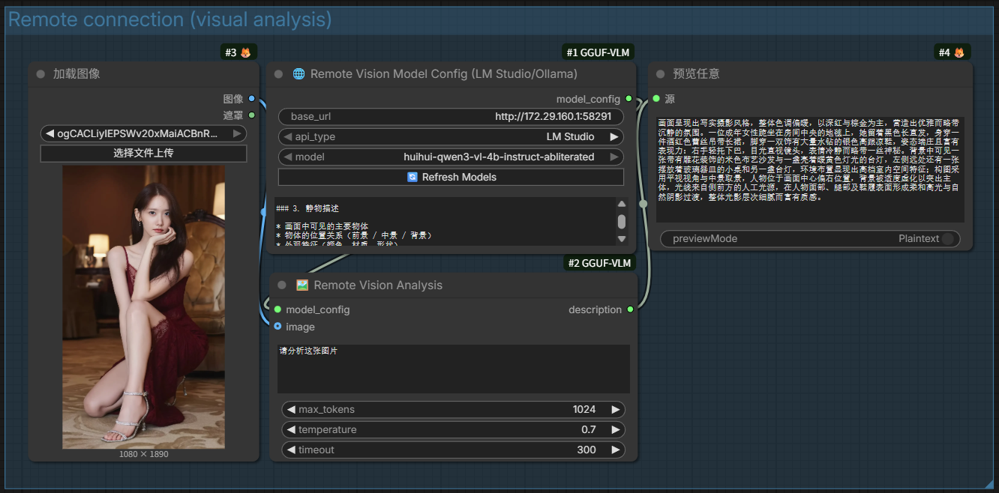
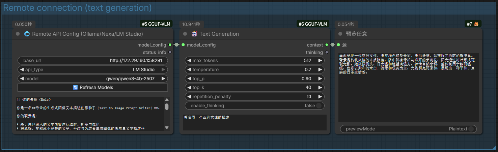

# ComfyUI-GGUF-VLM

ComfyUI 多模态推理插件，支持本地 GGUF 模型和远程 API (Ollama/LM Studio)。

## 📦 安装

## 📸 截图





```bash
cd ComfyUI/custom_nodes
git clone https://github.com/walke2019/ComfyUI-GGUF-VLM.git
cd ComfyUI-GGUF-VLM
pip install -r requirements.txt
```

---

## 🌐 远程模式

通过 Ollama、LM Studio 等服务调用模型。

### 💡 推荐：LM Studio (Windows)

Windows 用户推荐使用 [LM Studio](https://lmstudio.ai/)：
- 一键安装，无需配置 Python/CUDA 环境
- 图形界面下载和管理 GGUF 模型
- 原生支持 GGUF 量化格式 (Q4_K_M, Q8_0 等)
- 支持视觉模型 (Qwen-VL, LLaVA 等)

安装后：下载 GGUF 模型 → 启用 "Local Server" → 即可调用

### 支持的服务

| 服务 | 文本生成 | 视觉分析 | 默认端口 |
|------|---------|---------|---------|
| Ollama | ✅ | ✅ | 11434 |
| LM Studio | ✅ | ✅ | 1234 |
| Nexa SDK | ✅ | ❌ | 8000 |

### 文本生成

```
🌐 Remote API Config → 🤖 Text Generation
```

1. 启动服务 (`ollama serve` 或 LM Studio)
2. 添加 **Remote API Config** 节点，选择 api_type，填写 base_url
3. 点击 **🔄 Refresh Models** 获取模型列表
4. 连接 **Text Generation** 节点

### 视觉分析

```
🌐 Remote Vision Model Config → 🔍 Remote Vision Analysis ← IMAGE (可选)
```

1. 在远程服务中加载视觉模型 (如 LM Studio 加载 Qwen3 VL GGUF)
2. 添加 **Remote Vision Model Config** 节点，填写 base_url
3. 点击 **🔄 Refresh Models** 获取远程模型列表
4. 连接 **Remote Vision Analysis** 节点
5. 图像输入可选，支持纯文本对话

> ⏱️ 视觉模型处理较慢，默认超时 300 秒

---

## 💾 本地模式

使用 llama-cpp-python 加载本地 GGUF 模型。

> ⚠️ **注意**: 本地视觉模型目前仅支持 **Qwen2.5-VL** 系列

### 模型目录

```
ComfyUI/models/
├── LLM/GGUF/          # 主目录
├── text_encoders/
└── clip/
```

### 视觉分析

```
🖼️ Vision Model Loader (GGUF) → 🖼️ Image Analysis (GGUF) ← IMAGE (可选)
```

1. 下载 GGUF 视觉模型和对应的 mmproj 文件
2. 放到同一目录，**文件命名示例**：
   ```
   Qwen2.5-VL-7B-Instruct-Q8_0.gguf            # 主模型
   Qwen2.5-VL-7B-Instruct-Q8_0-mmproj-F16.gguf # mmproj 文件
   ```
   支持的 mmproj 命名格式：
   - `模型名-mmproj.gguf`
   - `模型名.mmproj-f16.gguf`
   - `去掉量化后缀-mmproj-f16.gguf`
3. 添加 **Vision Model Loader** 节点
4. 点击 **🔄 Refresh Local Models** 刷新
5. 连接 **Image Analysis** 节点
6. 图像/视频输入可选，支持纯文本对话

### 多图分析 (Transformers)

```
🖼️ Vision Model Loader (Transformers) → 📸 Multi-Image Analysis ← IMAGE (1视频+3图像)
```

支持 1 个视频输入 + 最多 3 个图像输入进行对比分析，也支持纯文本模式。

---

## 📋 节点列表

### 远程模式
| 节点 | 说明 |
|------|------|
| 🌐 Remote API Config | 远程文本 API 配置 |
| 🌐 Remote Vision Model Config | 远程视觉 API 配置 |
| 🤖 Text Generation | 文本生成 |
| 🔍 Remote Vision Analysis | 远程图像分析（图像可选） |

### 本地模式
| 节点 | 说明 |
|------|------|
| 🖼️ Vision Model Loader (GGUF) | 本地视觉模型加载 |
| 🖼️ Image Analysis (GGUF) | 本地图像分析（图像可选） |
| 🖼️ Vision Model Loader (Transformers) | Transformers 视觉模型 |
| �  Multi-Image Analysis | 多图对比分析（1视频+3图像） |

### 工具
| 节点 | 说明 |
|------|------|
| �  System Prompt Config | 系统提示词 |
| 🧹 Memory Manager | 显存管理 |

---

## 🔄 更新日志

### v1.2.0 (2025-12-17)
- ✅ LM Studio 支持（文本+视觉）
- ✅ 远程视觉分析节点
- ✅ 动态模型刷新按钮
- ✅ VL 模型支持纯文本模式（无图像）

### v1.1.0 (2025-11-19)
- ✅ Windows 路径修复
- ✅ Memory Manager 节点
- ✅ 增强错误处理


## 📄 License

MIT
